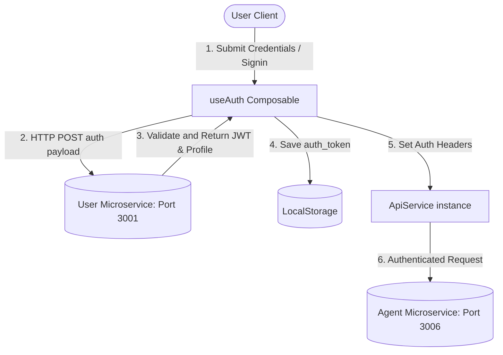
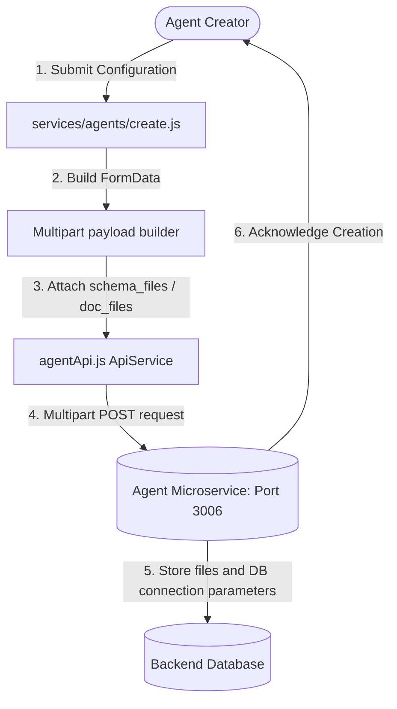
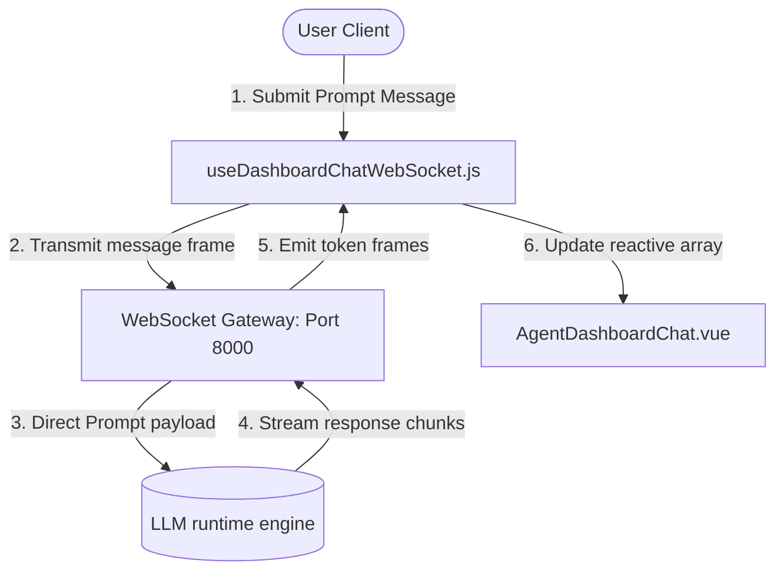
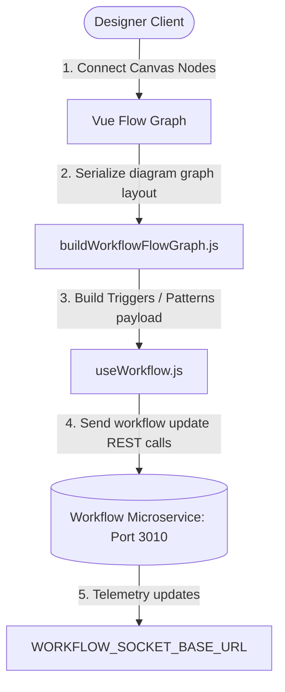

# AI Agent Builder - Frontend Developer Guide


> [!NOTE]
> The AI Agent Builder is a **Vue 3** single-page application built with **Vite** and **Tailwind CSS**. It runs on port **3002** during local development and is integrated as a workspace project within the `ai-suite` monorepo.

---

## 1. System & Technology Stack

The frontend is a modern web application built using the following stack:
*   **Core Framework**: Vue 3 (utilizing the `<script setup>` Composition API syntax).
*   **Build Tool & Dev Server**: Vite (configured for fast HMR and module resolution).
*   **Styling**: Vanilla CSS with Tailwind CSS (using custom theme configurations in [tailwind.config.js](file:///home/arya/DEVELOPMENT/iBoson-ai=suite/ai-suite-monorepo/apps/ai-agent-builder/tailwind.config.js) and shared utility sheets).
*   **Visual Diagram/Graph Editor**: `@vue-flow/core` (interactive graph canvas for building visual agent execution pipelines).
*   **WebSocket Gateway**: Browser native WebSockets (integrated via Vue composables for real-time chat feeds).
*   **Voice Integration**: Browser audio recorder API connected to OpenAI and ElevenLabs TTS/STT services.

---

## 2. Monorepo Structure & Directory Breakdown

The codebase resides inside a monorepo workspace. The frontend dependencies and shared layout elements are split between `apps/` and `packages/` to ensure reusability.

### Workspace Folder Map
```
ai-suite-monorepo/
├── apps/
│   └── ai-agent-builder/               # <-- Core Agent Builder Application
│       ├── docs/
│       │   └── FRONTEND_GUIDE.md       # <-- This documentation file
│       ├── public/                     # Static assets directly exposed to web server
│       ├── src/
│       │   ├── assets/                 # Static files (images, icons, svgs)
│       │   ├── components/             # App-specific Vue components
│       │   │   ├── VerifyEmail/        # Verify email flow views
│       │   │   ├── agents/             # Single/Multi-Agent config, modals, panels
│       │   │   │   ├── dashboard/      # Agent control center and setups
│       │   │   │   │   ├── setup/      # Integrations (API, Phone, SDK forms)
│       │   │   │   │   └── sidebars/   # Settings, knowledge, deployment panels
│       │   │   │   ├── knowledge/      # Ingestors (DB configurations, document uploaders)
│       │   │   │   └── multi/          # Multi-agent setups and modals
│       │   │   ├── auth/               # Login/Register inputs validation views
│       │   │   ├── home/               # Homepage panels and chat starter cards
│       │   │   └── workflow/           # Visual canvas nodes, triggers, router forms
│       │   ├── composables/            # Reactive composable logic functions
│       │   │   ├── useAuth.js          # Authentication hooks
│       │   │   ├── useWorkflow.js      # Pipeline state triggers handler
│       │   │   └── useDashboardChatWebSocket.js # WebSocket connection manager
│       │   ├── router/                 # App routing configuration
│       │   ├── services/               # API callers, gateways, constants
│       │   │   ├── agentApi.js         # REST Api client class
│       │   │   └── constants.js        # Environment and API constant endpoints
│       │   ├── utils/                  # Helper functions (formatting, error mappings)
│       │   ├── views/                  # Route page views (ChatView, AgentsView, WorkflowsView)
│       │   ├── App.vue                 # Main application entry view
│       │   ├── main.js                 # Application bootstrapping & mounting
│       │   └── style.css               # Base styles and tailwind imports
│       ├── index.html                  # Core HTML file
│       ├── tailwind.config.js          # Local Tailwind configs
│       └── vite.config.js              # Vite server & loader configs
└── packages/
    └── shared-ui/                      # <-- Reusable UI library
        ├── src/
        │   ├── components/             # Global UI wrappers (Sidebar, Mobile Header, User Popups)
        │   ├── styles/                 # Main shared styles library (Main.css)
        │   └── views/                  # Shared views (Dashboard.vue, SettingsView.vue, auth views)
        └── package.json                # Shared UI package meta
```

---

## 3. Application Entry & Bootstrap Flow

The bootstrap flow begins in [main.js](file:///home/arya/DEVELOPMENT/iBoson-ai=suite/ai-suite-monorepo/apps/ai-agent-builder/src/main.js):

1.  **Session Hygiene**: Local storage is scanned for corrupted session values (empty strings, `"undefined"`, or `"null"` strings in token keys). Corrupted keys are deleted to prevent login redirection loops.
2.  **API Authorization**: If a valid authentication token resides in `localStorage`, it is set on the central `apiService` via `apiService.setAuthToken(token)`.
3.  **Initialization**: The Vue application instance is created from [App.vue](file:///home/arya/DEVELOPMENT/iBoson-ai=suite/ai-suite-monorepo/apps/ai-agent-builder/src/App.vue), registered with the router, and mounted to `#app` inside [index.html](file:///home/arya/DEVELOPMENT/iBoson-ai=suite/ai-suite-monorepo/apps/ai-agent-builder/index.html).

---

## 4. Routing & Authentication Guard Rules

Application routing is managed in [router/index.js](file:///home/arya/DEVELOPMENT/iBoson-ai=suite/ai-suite-monorepo/apps/ai-agent-builder/src/router/index.js).

### Route Categories
*   **Public Paths**: Unauthenticated routes, including authentication views (`/signin`, `/signup`, `/email-validation`, `/password`, `/forgot-password`, `/reset-link`, `/reset-password`, `/password-confirm`, `/password-updation`, `/deleted-message`, `/verify-email`, `/verify-email-token`, `/auth/google/callback`).
*   **Protected Paths**: Authenticated routes requiring valid credentials (`/home`, `/agents`, `/workflows`, `/settings`, `/agent-dashboard`, `/multi-agent-dashboard`).

### Navigation Guards (`beforeEach`)
*   **Logout Query Detection**: If the route has query parameter `logout=1` or `logout=true`, the session credentials are wiped from `localStorage`, and the user is redirected to `/signin`.
*   **Google Authentication Callback**: Handles OAuth callback redirection by reading the `token` query parameter, saving it in `localStorage` under `auth_token`, and redirecting to `/home`.
*   **Signed-in Redirects**: If a signed-in user navigates to `/signin` or `/signup`, they are automatically redirected to `/home` unless the route query contains `relogin=1`.
*   **Verification Redirects**: If a user is not signed in and attempts to access any path not in the `PUBLIC_PATHS` list, the router forces a redirect to `/signin`.

---

## 5. Shell Dashboard Wrapper Integration

To maintain design consistency across multiple apps in the monorepo, a shared layout wrapper is used.
*   The main shell [Dashboard.vue](file:///home/arya/DEVELOPMENT/iBoson-ai=suite/ai-suite-monorepo/packages/shared-ui/src/views/Dashboard.vue) is imported from `@ai-suite/shared-ui` and acts as the view component for `/home`, `/agents`, `/workflows`, and `/settings`.
*   The shell imports configuration parameters from the app-specific [dashboard.js](file:///home/arya/DEVELOPMENT/iBoson-ai=suite/ai-suite-monorepo/apps/ai-agent-builder/src/services/dashboard/dashboard.js).
*   The dashboard service defines:
    *   Route-to-tab mappings.
    *   The view components mapping (`chat` to [ChatView.vue](file:///home/arya/DEVELOPMENT/iBoson-ai=suite/ai-suite-monorepo/apps/ai-agent-builder/src/views/ChatView.vue), `agents` to [AgentsView.vue](file:///home/arya/DEVELOPMENT/iBoson-ai=suite/ai-suite-monorepo/apps/ai-agent-builder/src/views/AgentsView.vue), and `workflows` to [WorkflowsView.vue](file:///home/arya/DEVELOPMENT/iBoson-ai=suite/ai-suite-monorepo/apps/ai-agent-builder/src/views/WorkflowsView.vue)).
    *   Responsive layout behaviors (e.g., whether to hide sidebars dynamically).
*   When navigating to `/workflows` and opening a workflow editor, the `WorkflowsView.vue` component emits `toggle-sidebar` to collapse the navigation sidebar and maximize editor canvas space.

---

## 6. Centralized API Service Layer

The frontend interfaces with several backend microservices via the `ApiService` class in [agentApi.js](file:///home/arya/DEVELOPMENT/iBoson-ai=suite/ai-suite-monorepo/apps/ai-agent-builder/src/services/agentApi.js).

### Microservice Host Mappings
Host URLs are mapped in [constants.js](file:///home/arya/DEVELOPMENT/iBoson-ai=suite/ai-suite-monorepo/apps/ai-agent-builder/src/services/constants.js):

| URL Constant | Dev Environment Port | Microservice Purpose |
| :--- | :--- | :--- |
| `USER_API_URL` | `http://localhost:3001` | User registration, authentication profiles |
| `AGENT_API_URL` | `http://localhost:3006` | Single Agent data, knowledge file syncs |
| `CHAT_API_URL` | `http://localhost:3003` | Conversation session and historical logs |
| `API_DEPLOYMENT_URL` | `http://localhost:3004` | Third-party widget integrations and tokens |
| `PAYMENT_API_URL` | `http://localhost:3005` | Pricing plans and subscriptions tracking |
| `NOTIFICATION_API_URL` | `http://localhost:3007` | Workspace alert streams |
| `CHAT_AI_API_URL` | `http://localhost:3003` | LLM execution runtime wrapper |
| `WORKFLOW_API_URL` | `http://localhost:3010` | Interactive pipelines state and sequences |

---

## 7. Data Flow Diagrams (DFDs)

### A. Authentication & Session DFD (Level 0)
This diagram details how the user logs in, how tokens are persisted, and how authenticated API requests are authorized.



### B. Agent Creation & Knowledge Provisioning DFD (Level 1)
Details the ingestion of metadata, database configurations, OpenAPI schemas, and document files into a single agent record.



### C. Real-time Conversational Stream DFD (Level 1)
Maps user prompt submission, WebSocket routing, streaming response chunks from LLMs, and real-time UI state updates.



### D. Visual Workflow Pipeline Builder DFD (Level 1)
Shows how visual node configurations are built on the canvas and synced with the workflow service.



---

## 8. Connected APIs: Path, Payloads, & Methods

### A. Authentication Modules

#### 1. Registration / Signup
*   **Service Method**: `apiService.signup(userData)`
*   **HTTP Path**: `POST http://localhost:3001/api/auth/register`
*   **Request Payload**:
    ```json
    {
      "name": "Jane Doe",
      "email": "jane@example.com",
      "password": "SecurePassword123"
    }
    ```
*   **Response Structure**:
    ```json
    {
      "status": true,
      "message": "User registered successfully",
      "data": {
        "user": {
          "id": "user_123",
          "email": "jane@example.com",
          "name": "Jane Doe"
        }
      }
    }
    ```

#### 2. User Login
*   **Service Method**: `apiService.login(credentials)`
*   **HTTP Path**: `POST http://localhost:3001/api/auth/login`
*   **Request Payload**:
    ```json
    {
      "email": "jane@example.com",
      "password": "SecurePassword123"
    }
    ```
*   **Response Structure**:
    ```json
    {
      "status": true,
      "token": "JWT_TOKEN_STRING",
      "user": {
        "id": "user_123",
        "email": "jane@example.com"
      }
    }
    ```

---

### B. Single & Multi-Agent Configurations

#### 1. Fetch Agents List
*   **Service Methods**:
    *   Single Agents: `apiService.getAgentData(page, limit, status, search)`
    *   Multi-Agents: `apiService.getMultiAgents(page, limit, kind, search, active)`
*   **HTTP Paths**:
    *   Single: `GET http://localhost:3006/api/agents?page=1&limit=12&status=published&search=marketing`
    *   Multi: `GET http://localhost:3006/api/agent-groups?page=1&limit=12&is_active=true`
*   **Response Structure (Single Agents)**:
    ```json
    {
      "status": true,
      "data": {
        "agents": [
          {
            "id": "agent_99",
            "name": "Market Researcher",
            "prompt": "You are a research analyst...",
            "role": "Researcher",
            "rules": ["Be concise"],
            "status": "published",
            "updated_at": "2026-06-12T11:00:00Z"
          }
        ],
        "pagination": {
          "current_page": 1,
          "has_next": false,
          "total_items": 1
        }
      }
    }
    ```

#### 2. Create Single Agent
*   **Service Method**: `apiService.createAgentWithFiles(agentData, schemaFiles, documentFiles, knowledgeType)`
*   **HTTP Path**: `POST http://localhost:3006/api/agents`
*   **Content-Type**: `multipart/form-data`
*   **Payload Parameters**:
    *   `name`: String
    *   `prompt`: String (system prompt directive)
    *   `role`: String
    *   `rules`: Array of strings
    *   `auth_type`: `bearer_token` | `document_access` | `db_credentials` | `composio_creds`
    *   `base_url`: API connector base url (if `auth_type` is `bearer_token` or `document_access`)
    *   `token`: Access token credentials (if `auth_type` is `bearer_token` or `document_access`)
    *   `db_config`: Database credentials configuration (JSON object containing host, port, username, password, database, and type)
    *   `schema_files`: Binary files (Multipart OpenAPI JSON/YAML)
    *   `document_files`: Binary files (Multipart PDFs/Docs)
*   **Response Structure**:
    ```json
    {
      "status": true,
      "message": "Agent created successfully",
      "agent": {
        "id": "agent_100",
        "name": "Sales Copilot",
        "status": "published"
      }
    }
    ```

#### 3. Create Multi-Agent Group
*   **Service Method**: `apiService.requestAgent('/api/agent-groups', { method: 'POST', body: JSON.stringify(payload) })`
*   **HTTP Path**: `POST http://localhost:3006/api/agent-groups`
*   **Request Payload**:
    ```json
    {
      "group_name": "DevOps Taskforce",
      "description": "Collaborative DevOps workflow automation system",
      "agent_ids": ["agent_id_1", "agent_id_2"]
    }
    ```
*   **Response Structure**:
    ```json
    {
      "status": true,
      "data": {
        "id": "group_300",
        "group_name": "DevOps Taskforce",
        "is_active": true
      }
    }
    ```

---

### C. Visual Workflow Builder Engine

#### 1. Fetch Workflow Configurations
*   **Service Method**: `apiService.getWorkflows(page, limit, status, search)`
*   **HTTP Path**: `GET http://localhost:3010/api/workflows?page=1&limit=20`
*   **Response Structure**:
    ```json
    {
      "status": true,
      "data": {
        "workflows": [
          {
            "id": "workflow_450",
            "name": "Lead Enrichment Engine",
            "status": "draft",
            "execution_order": 1
          }
        ],
        "pagination": {
          "current_page": 1,
          "has_next": false,
          "total_items": 1
        }
      }
    }
    ```

#### 2. Create Trigger Event (Webhook, Cron etc.)
*   **Service Method**: `apiService.createWorkflowTrigger(workflowId, payload)`
*   **HTTP Path**: `POST http://localhost:3010/api/workflows/workflow_450/triggers`
*   **Request Payload**:
    ```json
    {
      "name": "Webhook Trigger",
      "type": "webhook",
      "configuration": {
        "method": "POST",
        "token_auth": true
      }
    }
    ```

#### 3. Upsert Human-In-The-Loop Configuration (HITL)
*   **Service Method**: `apiService.updateHitlConfig(workflowId, payload)`
*   **HTTP Path**: `PUT http://localhost:3010/api/workflows/workflow_450/hitl`
*   **Request Payload**:
    ```json
    {
      "is_enabled": true,
      "pause_on": "failure",
      "contact_channel": "email",
      "message_template": "Workflow step failed, manual approval requested.",
      "timeout_hours": 24,
      "on_timeout": "reject",
      "owner_message": "Action required by admin."
    }
    ```

---

## 9. WebSocket Communication Protocols

Real-time message routing avoids database polling. The connections are established via HTML5 native WebSockets.

### A. Dashboard Client Chats
*   **Connection URL**: `ws://localhost:8000/ws` (constructed from configuration constant `CHAT_AI_API_URL_WS`)
*   **Lifecycle Composables**: [useDashboardChatWebSocket.js](file:///home/arya/DEVELOPMENT/iBoson-ai=suite/ai-suite-monorepo/apps/ai-agent-builder/src/composables/useDashboardChatWebSocket.js)

#### Inbound Frame Formats (Server -> Client)

##### Connection Welcome
```json
{
  "type": "connection_established",
  "session_id": "socket_conn_456"
}
```

##### Dynamic Tokens Stream
```json
{
  "type": "token",
  "chat_id": "chat_session_88",
  "content": "Next step details..."
}
```

##### Response Completion
```json
{
  "type": "message_completed",
  "chat_id": "chat_session_88",
  "message": {
    "id": "msg_900",
    "role": "assistant",
    "content": "Complete parsed markdown output content response."
  }
}
```

#### Outbound Frame Formats (Client -> Server)

##### Send Message Frame
```json
{
  "action": "send_message",
  "chat_id": "chat_session_88",
  "content": "Can you analyze this server log payload?"
}
```

### B. Live Workflow Execution Telemetry
*   **Connection URL**: `ws://localhost:8000` (path: `/workflow-agent`)
*   **WebSocket Constant**: `WORKFLOW_SOCKET_BASE_URL`
*   **Purpose**: Establishes live telemetry log pipelines that track visual execution patterns across agent canvas nodes.

---

## 10. Visual Canvas Node Specifications

The visual workspace represents pipeline topologies through structured custom nodes defined in Vue Flow:

*   **Hub Center Node** ([WfWorkflowHub.vue](file:///home/arya/DEVELOPMENT/iBoson-ai=suite/ai-suite-monorepo/apps/ai-agent-builder/src/components/workflow/WfWorkflowHub.vue)):
    *   Handles workflow entry points.
    *   Directs source links to pattern nodes.
    *   Manages HITL (Human-in-the-Loop) settings overlays.
*   **Pattern Block Nodes** ([WfPatternNode.vue](file:///home/arya/DEVELOPMENT/iBoson-ai=suite/ai-suite-monorepo/apps/ai-agent-builder/src/components/workflow/WfPatternNode.vue)):
    *   Wraps individual single agents grouped together as execution tasks.
    *   Tracks drag-and-drop actions.
    *   Controls active triggers within patterns.
*   **Conditional Routers** ([WfRouterNode.vue](file:///home/arya/DEVELOPMENT/iBoson-ai=suite/ai-suite-monorepo/apps/ai-agent-builder/src/components/workflow/WfRouterNode.vue)):
    *   Manages branching conditional execution rules based on agent output fields.

### Interactive Connector Constraints
Defined in [workflowFlowConnectionRules.js](file:///home/arya/DEVELOPMENT/iBoson-ai=suite/ai-suite-monorepo/apps/ai-agent-builder/src/composables/workflowFlowConnectionRules.js):
*   Prevents connecting outputs directly back to input trigger chips.
*   Ensures sequence flow links connect from sources to targets in a directed acyclic format.

---

## 11. Local Development Setup & Troubleshooting

### A. Environment Configuration
Duplicate the configuration template to configure environment variables:
```bash
cp apps/ai-agent-builder/.env.example apps/ai-agent-builder/.env
```

Review the values inside [apps/ai-agent-builder/.env](file:///home/arya/DEVELOPMENT/iBoson-ai=suite/ai-suite-monorepo/apps/ai-agent-builder/.env):
*   `VITE_API_BASE_URL`: Root URL pointing to your backend API gateway deployment.
*   `VITE_SOCKET_BASE_URL`: Real-time WebSocket connection endpoint.
*   `VITE_GOOGLE_CLIENT_ID`: Public client ID key configuration for Google sign-in.
*   `VITE_ELEVENLABS_API_KEY`: ElevenLabs key for text-to-speech features.
*   `VITE_OPENAI_API_KEY`: OpenAI API key configuration for OpenAI TTS.

### B. Launching Local Environment
Ensure you run configuration steps from the monorepo root directory.

1.  Install workspace dependencies:
    ```bash
    npm install
    ```
2.  Run the developer environment server:
    ```bash
    npm run dev:agent-builder
    ```

The application dev server starts, listening on port **3002**: [http://localhost:3002](http://localhost:3002).

### C. Common Troubleshooting Actions

#### Redirection Loops to `/signin`
*   Check if your local storage token is expired or holds invalid text data like `"null"` or `"undefined"`.
*   Clean `localStorage` keys by opening the Developer Tools Console and running `localStorage.clear()`.

#### Vite Build Failures
*   Verify Node modules sync by running `npm ci` at the root folder.
*   Ensure the correct configuration of your `.env` variables. Vite compiles values at build-time.
